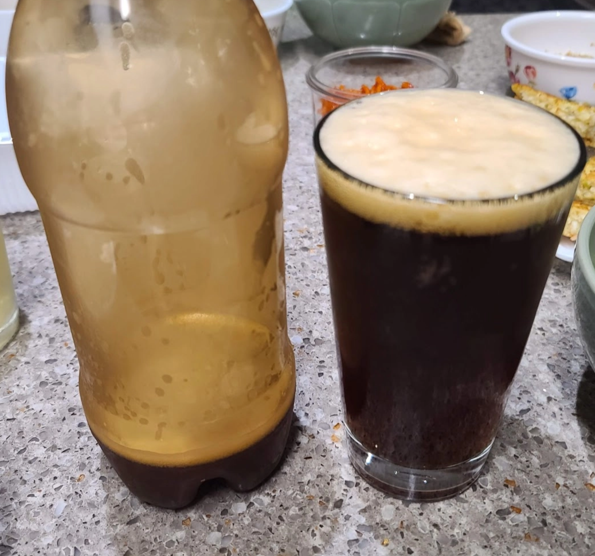

# 붕어빵 Weizen

> 20L · Extract · 2021 양조

팥을 넣어 붕어빵의 풍미를 표현한 실험적 바이젠. 유당을 추가해 단맛과 바디감을 보강했다.

## Ingredients

### Fermentables

| 종류 | 무게 |
|------|------|
| Wheat LME | 1.5 kg |
| Carapils | 300 g |

### Adjuncts

| 종류 | 무게 |
|------|------|
| 팥 (Red Bean) | 1 kg |
| 유당 (Lactose) | 500 g |

### Hop

| 종류 | 용도 |
|------|------|
| Saphir | boil |

### Yeast

Safbrew WB-06

## Brew Notes

2021년 양조. 붕어빵 컨셉으로 팥을 부재료로 사용.

## Tasting Notes

