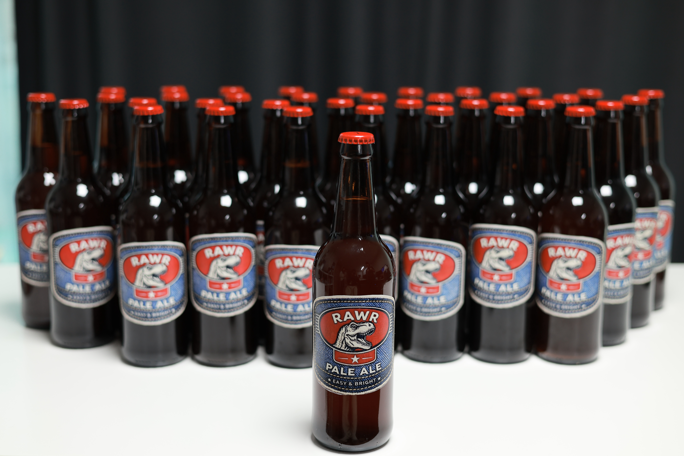
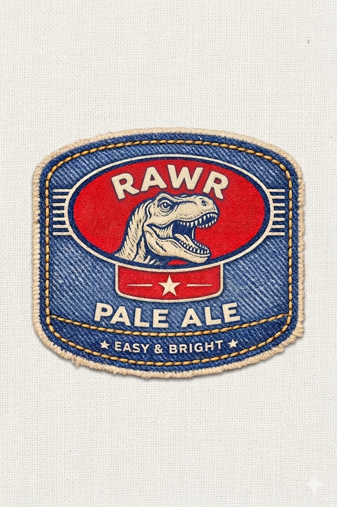

# RAWR American Pale Ale

> 20L · All Grain · 양조일 2026-03-29 · 병입일 2026-04-12

## Stats

| OG | FG | ABV | IBU | SRM |
|----|----|----|-----|-----|
| 1.056 | 1.000 | 7.4% | 66 | 9.8 |

발효: 14일

## Ingredients

### Malt

| 종류 | 무게 |
|------|------|
| Briess Pale Ale Malt | 4.025 kg |
| Weyermann Munich I Malt | 1.44 kg |
| Briess Caramel Malt 40L | 0.36 kg |

### Hop

| 종류 | 무게 | 시간 | 용도 |
|------|------|------|------|
| Magnum | 28.3g | 60min | boil |
| Cascade | 28.22g | 30min | boil |
| Chinook | 27.93g | 10min | boil |
| Centennial | 27.86g | 1min | boil |
| Centennial | 30g | 7일 | dryhop |

### Yeast

Safale US-05 — 11.5g 1팩

## Process

### Mashing

- 스트라이크 워터: 18.4L @ 77°C
- 몰트 투입 후 **68°C에서 60분**

### Sparging

- 스파지 워터: 8.7L @ 85°C

### Boiling

- 프리보일: 29L
- 당화용수: 20.7L
- 보일 시간: 60분

## Gravity Readings

| Day | 날짜 | SG |
|-----|------|----|
| 0 | 03-29 (양조일) | 1.056 |
| +5 | 04-03 (금) | 1.009 |
| +7 | 04-05 (일) | 1.005 |
| +14 | 04-12 (병입일) | 1.000 |

## Tasting Notes

## Brew Notes

재료 구매: [드림프 스마트스토어](https://smartstore.naver.com/dreamp/products/6224655843)

## 정산

| 항목 | 금액 |
|------|------|
| 재료 (몰트, 홉, 효모 등) | |
| 공방 대여비 | |
| 병 | |
| 기타 | |
| **합계** | **원** |
