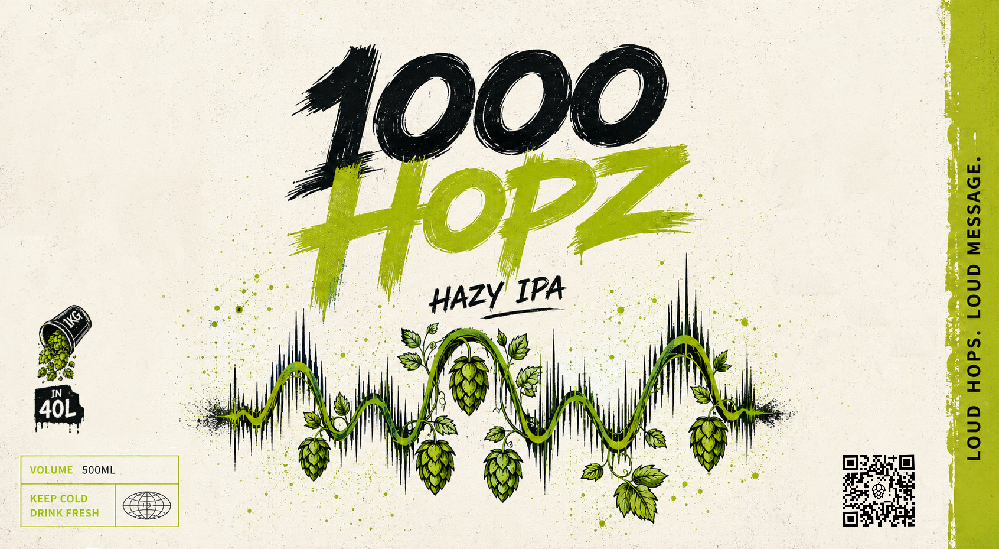

# **Citra / Mosaic / Azacca LupoMAX NEIPA 양조 순서표**

## **0. 배치 개요**

| **항목**    | **내용**                                            |
| --------- | ------------------------------------------------- |
| 스타일       | New England IPA / Hazy IPA                        |
| 최종 배치 사이즈 | 32 L                                              |
| 보일 사이즈    | 64 L                                              |
| 보일 시간     | 180분                                              |
| 목표 OG     | 1.070 → 1.053                                     |
| 목표 FG     | 1.019–1.020 → 1.018(05.31)                        |
| 예상 ABV    | 약 6.6% → 4.6%                                     |
| 효모        | White Labs WLP067 Coastal Haze Ale Yeast Blend 2팩 |
| 홉 컨셉      | Citra : Mosaic = 1 : 1, Azacca Spectrum 보조        |

---

## **1. 재료 준비**

## **1.1 곡물**

|**재료**|**양**|
|---|---|
|Weyermann Pilsner Malt|8.0 kg|
|Flaked Oats|2.0 kg|
|Flaked Red Wheat|2.0 kg|

**총 곡물량: 12.0 kg**

---

## **1.2 홉 / 추출물**

|**제품**|**총 사용량**|
|---|---|
|Citra LupoMAX|454 g|
|Mosaic LupoMAX|454 g|
|Azacca Spectrum|20 g|
### Hops

| Name                               | Weight | Time  | Use       | AA% |
| ---------------------------------- | ------ | ----- | --------- | --- |
| Citra LupoMAX                      | 14g    | 10min | boil      | 22  |
| Mosaic LupoMAX                     | 14g    | 10min | boil      | 24  |
| Citra LupoMAX                      | 28g    | 0min  | boil      | 22  |
| Mosaic LupoMAX                     | 28g    | 0min  | boil      | 24  |
| Citra LupoMAX                      | 84g    | 20min | whirlpool | 22  |
| Mosaic LupoMAX                     | 84g    | 20min | whirlpool | 24  |
| Citra LupoMAX (biotransformation)  | 70g    | 12d   | dryhop    | -   |
| Mosaic LupoMAX (biotransformation) | 70g    | 12d   | dryhop    | -   |
| Citra LupoMAX                      | 258g   | 5d    | dryhop    | -   |
| Mosaic LupoMAX                     | 258g   | 5d    | dryhop    | -   |
| Azacca Spectrum                    | 20g    | 5d    | dryhop    | -   |

---

## **1.3 효모 / 첨가물**

| **재료**                              | **양** | **사용 시점** |
| ----------------------------------- | ----- | --------- |
| WLP067 Coastal Haze Ale Yeast Blend | 2팩    | 피칭        |
| 비타민 C / Ascorbic Acid               | 3 g   | 패키징 직전    |
## **3.2 매싱 스케줄**

| **순서** | **단계**    | **온도** | **시간** | **메모**              |
| ------ | --------- | ------ | ------ | ------------------- |
| 1      | 프로틴 레스트   | 50°C   | 15분    | 단백질 분해, 거품/바디 보조    |
| 2      | 말토스 레스트   | 62°C   | 35분    | β-amylase, 발효성 당 생성 |
| 3      | 덱스트린화 레스트 | 68°C   | 35분    | α-amylase, 바디/잔당감   |
| 4      | 매시아웃      | 78°C   | 5분     | 효소 작용 정지            |

---

# **4. 퍼스트 워트 회수**

## **4.1 회수 목표**

|**항목**|**목표**|
|---|---|
|퍼스트 워트|약 24 L|

# **5. 스파징**

## **5.1 스파징 조건**

| **항목**     | **값**     |
| ---------- | --------- |
| 스파징 워터 온도  | 78–80°C   |
| 총 스파징 워터   | 약 40 L    |
| 스파징 방식     | 2회 분할 스파징 |
| 각 스파징 후 순환 | 약 15분     |

## **5.3 프리보일 목표**

|**항목**|**목표**|
|---|---|
|프리보일 볼륨|약 56 L|
|시스템에 따라 최대|약 64 L까지 가능|

### 저능행동
* MLT에 바주카포 안 끼운거 몰트 넣고 알아차리기
![[Pasted image 20260525234622.png|425]]