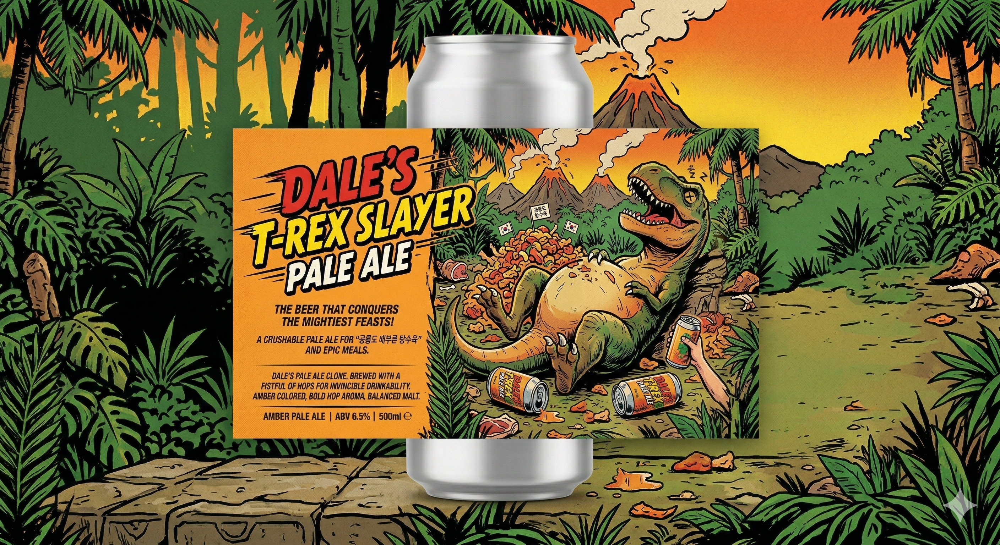

# **Citra / Mosaic / Azacca LupoMAX NEIPA 양조 순서표**



## **0. 배치 개요**

|**항목**|**내용**|
|---|---|
|스타일|New England IPA / Hazy IPA|
|최종 배치 사이즈|40 L|
|보일 사이즈|56 L|
|보일 시간|90분|
|목표 OG|1.070|
|목표 FG|1.019–1.020|
|예상 ABV|약 6.6%|
|효모|White Labs WLP067 Coastal Haze Ale Yeast Blend 2팩|
|홉 컨셉|Citra : Mosaic = 1 : 1, Azacca Spectrum 보조|

---

## **1. 재료 준비**

## **1.1 곡물**

|**재료**|**양**|
|---|---|
|Weyermann Pilsner Malt|8.0 kg|
|Flaked Oats|2.0 kg|
|Flaked Red Wheat|2.0 kg|

**총 곡물량: 12.0 kg**

---

## **1.2 홉 / 추출물**

|**제품**|**총 사용량**|
|---|---|
|Citra LupoMAX|454 g|
|Mosaic LupoMAX|454 g|
|Azacca Spectrum|20 g|

---

## **1.3 효모 / 첨가물**

|**재료**|**양**|**사용 시점**|
|---|---|---|
|WLP067 Coastal Haze Ale Yeast Blend|2팩|피칭|
|비타민 C / Ascorbic Acid|3 g 권장|패키징 직전|

---

# **2. 맥아 물먹임 / 분쇄**

## **2.1 물먹임**

껍질 있는 베이스 몰트에만 적용.

|**대상**|**방법**|
|---|---|
|Pilsner Malt 8 kg|물 약 1 L를 나눠 넣고 1분 정도 골고루 섞기|
|Flaked Oats / Flaked Wheat|물먹임하지 않음|

기준은 **맥아 4 kg당 물 약 500 mL**.

## **2.2 분쇄 목표**

- 껍질은 최대한 온전하게 유지
- 알맹이는 깨지게 분쇄
- 너무 곱게 갈지 않기
- 스파징 막힘과 탄닌 추출 방지

---

# **3. 매싱**

## **3.1 물 투입**

|**항목**|**양**|
|---|---|
|스트라이크 워터 / 스타트 워터|약 36 L|

HERMS 기준으로 12 kg 곡물 + 36 L 물은 꽤 많이 들어가는 편이라 넘침 주의.

---

## **3.2 매싱 스케줄**

|**순서**|**단계**|**온도**|**시간**|**메모**|
|---|---|---|---|---|
|1|프로틴 레스트|50°C|15분|단백질 분해, 거품/바디 보조|
|2|말토스 레스트|62°C|35분|β-amylase, 발효성 당 생성|
|3|덱스트린화 레스트|68°C|35분|α-amylase, 바디/잔당감|
|4|매시아웃|78°C|5분|효소 작용 정지|

### **매싱 중 체크**

- 62°C에서 68°C로 넘어가기 전 한 번 저어주기
- 가능하면 매시아웃 전 요오드 테스트
- 매시아웃은 78–80°C 범위 유지
- 80°C 이상으로 오래 올리지 않기

---

# **4. 퍼스트 워트 회수**

## **4.1 회수 목표**

|**항목**|**목표**|
|---|---|
|퍼스트 워트|약 24 L|

## **4.2 진행 메모**

- HERMS 순환으로 이미 어느 정도 맑아져 있으므로 별도 라우터링 부담은 적음.
- 첫 워트가 나오면 바로 끓이기 시작.
- 마지막 탁한 부분은 무리해서 전부 받지 않기.

---

# **5. 스파징**

## **5.1 스파징 조건**

|**항목**|**값**|
|---|---|
|스파징 워터 온도|78–80°C|
|총 스파징 워터|약 40 L|
|스파징 방식|2회 분할 스파징|
|각 스파징 후 순환|약 15분|

## **5.2 진행**

1. 밸브 방향을 바꿔 스파징 워터 투입
2. 물 투입 후 매시 베드를 저어서 풀어줌
3. 다시 밸브 방향을 바꿔 몰트 쪽으로 재순환
4. 약 15분 순환
5. 워트 회수
6. 2회 반복

## **5.3 프리보일 목표**

|**항목**|**목표**|
|---|---|
|프리보일 볼륨|약 56 L|
|시스템에 따라 최대|약 64 L까지 가능|

---

# **6. 보일**

## **6.1 보일 시간**

|**항목**|**값**|
|---|---|
|총 보일 시간|90분|

DMS 제거를 위해 충분히 끓임.

---

## **6.2 보일 홉 스케줄**

|**시점**|**Citra LupoMAX**|**Mosaic LupoMAX**|**메모**|
|---|---|---|---|
|10분 남음|14 g|14 g|약한 bittering / late boil|
|0분 / 불 끄는 시점|28 g|28 g|flameout 직전/직후 투입|

**수정 반영:**기존 0분 홉을 **Citra 28 g + Mosaic 28 g**으로 정리.

---

# **7. 월풀 / 홉스탠드**

## **7.1 월풀 조건**

|**항목**|**값**|
|---|---|
|월풀 온도|75–80°C|
|시간|15–20분|

## **7.2 월풀 홉**

|**시점**|**Citra LupoMAX**|**Mosaic LupoMAX**|
|---|---|---|
|75–80°C 도달 후|84 g|84 g|

**수정 반영:**월풀 홉은 **Citra 84 g + Mosaic 84 g** 사용.

### **월풀 메모**

- 80°C 아래로 떨어진 후 투입.
- 홉은 한 번에 뭉쳐 넣지 말고 고르게 뿌리기.
- LupoMAX는 alpha acid가 높으므로 너무 뜨거운 상태에서 오래 두면 쓴맛이 올라갈 수 있음.

---

# **8. 칠링 / 발효조 이송**

## **8.1 칠링**

- 칠러는 미리 소독.
- 워트를 30°C 아래까지 냉각.
- 가능하면 피칭 온도인 18–19°C 근처까지 낮춤.

## **8.2 발효조 이송**

- 마지막 탁한 kettle trub는 다 받지 않기.
- 발효조가 2개라면 양을 균등 분배.
- 각 발효조의 홉/효모/드라이홉도 동일 비율로 나눔.

---

# **9. 효모 피칭**

|**항목**|**값**|
|---|---|
|효모|WLP067 Coastal Haze Ale Yeast Blend|
|양|2팩|
|피칭 온도|18–19°C|

## **발효 온도 계획**

|**단계**|**온도**|
|---|---|
|피칭 직후|18–19°C|
|활발한 발효|19–21°C|
|발효 후반|20–21°C|

---

# **10. 바이오트랜스포메이션 드라이홉**

## **10.1 투입 시점**

|**시점**|**기준**|
|---|---|
|피칭 후 24–36시간|발효가 활발할 때|

## **10.2 투입량**

|**홉**|**양**|
|---|---|
|Citra LupoMAX|70 g|
|Mosaic LupoMAX|70 g|

발효조가 2개라면:

|**발효조당**|**양**|
|---|---|
|Citra LupoMAX|35 g|
|Mosaic LupoMAX|35 g|

### **메모**

- 투입 시 산소 유입을 최소화.
- 투입 후 빠르게 닫기.
- 이 단계는 최종 향보다는 효모-홉 상호작용 목적.

---

# **11. 메인 드라이홉**

## **11.1 투입 시점**

|**시점**|**기준**|
|---|---|
|종말비중 근처 또는 발효가 거의 끝난 시점|FG 1.019–1.020 근처|

## **11.2 투입량**

|**홉**|**양**|
|---|---|
|Citra LupoMAX|258 g|
|Mosaic LupoMAX|258 g|
|Azacca Spectrum|20 g|

여기서 Citra/Mosaic 총량을 맞춘 이유:

```text
Citra 총량 454 g
= 14 g boil 10min
+ 28 g boil 0min
+ 84 g whirlpool
+ 70 g biotransformation
+ 258 g main dry hop

Mosaic 총량도 동일하게 454 g
```

발효조가 2개라면:

|**발효조당**|**양**|
|---|---|
|Citra LupoMAX|129 g|
|Mosaic LupoMAX|129 g|
|Azacca Spectrum|10 g|

## **11.3 접촉 시간**

|**항목**|**값**|
|---|---|
|드라이홉 접촉 시간|2–4일|
|이후|가능하면 산소 유입 없이 콜드크래시|

---

# **12. 콜드크래시**

|**항목**|**값**|
|---|---|
|시점|메인 드라이홉 2–4일 후|
|목적|홉 찌꺼기 침전, 패키징 안정화|
|주의|외부 공기 역류 방지|

콜드크래시 중 공기가 빨려 들어가면 NEIPA 산화가 빠르게 진행될 수 있음.

---

# **13. 패키징 / 비타민 C 투입**

## **13.1 비타민 C**

|**첨가물**|**양**|**시점**|
|---|---|---|
|비타민 C / Ascorbic Acid|3 g|패키징 직전|

발효조가 2개라면:

|**발효조당**|**양**|
|---|---|
|비타민 C|1.5 g|

### **투입 방법**

1. 소량의 끓였다 식힌 물에 비타민 C를 녹임
2. 가능하면 산소 접촉 없이 패키징 용기에 먼저 넣음
3. 맥주를 아래에서부터 조용히 이송

---

# **14. 병입 / 케깅**

## **병입할 경우**

|**항목**|**값**|
|---|---|
|프라이밍 슈가|약 5 g/L|

### **병입 주의**

- 꼭지에 호스를 연결
- 호스를 병 바닥까지 넣고 아래부터 차오르게 채움
- 튀김/거품/낙차 최소화
- 병입 후 빨리 마시기

## **케깅할 경우**

- 케그를 CO₂로 purge
- 가능하면 closed transfer
- 산소 접촉 최소화
- 이 레시피는 케깅 쪽이 훨씬 유리함

---

# **15. 전체 홉 사용량 요약**

|**단계**|**Citra LupoMAX**|**Mosaic LupoMAX**|**Azacca Spectrum**|
|---|---|---|---|
|Boil 10 min|14 g|14 g|-|
|Boil 0 min|28 g|28 g|-|
|Whirlpool|84 g|84 g|-|
|Biotransformation DH|70 g|70 g|-|
|Main DH|258 g|258 g|20 g|
|**Total**|**454 g**|**454 g**|**20 g**|

---

# **16. 최종 체크리스트**

```markdown
## 양조 전
- [ ] 곡물 12 kg 준비
- [ ] Pilsner malt 물먹임 후 분쇄
- [ ] Flaked oats/wheat는 물먹임하지 않음
- [ ] 효모 WLP067 2팩 실온 적응
- [ ] 발효조, 호스, 꼭지, 깔때기 소독

## 매싱
- [ ] 36 L 스트라이크 워터 준비
- [ ] 50°C 15분
- [ ] 62°C 35분
- [ ] 68°C 35분
- [ ] 78°C 5분

## 스파징 / 보일
- [ ] 퍼스트 워트 약 24 L 회수
- [ ] 스파징 2회
- [ ] 프리보일 약 56 L 확보
- [ ] 90분 보일
- [ ] 10분: Citra 14 g + Mosaic 14 g
- [ ] 0분: Citra 28 g + Mosaic 28 g

## 월풀 / 칠링
- [ ] 75–80°C까지 냉각
- [ ] 월풀: Citra 84 g + Mosaic 84 g
- [ ] 15–20분 유지
- [ ] 18–19°C 근처까지 냉각

## 발효
- [ ] WLP067 2팩 피칭
- [ ] 18–21°C 발효
- [ ] 24–36시간 후 Citra 70 g + Mosaic 70 g 드라이홉

## 메인 드라이홉
- [ ] 종말비중 근처에서 Citra 258 g + Mosaic 258 g
- [ ] Azacca Spectrum 20 g
- [ ] 접촉 2–4일

## 패키징
- [ ] 비타민 C 3 g
- [ ] 산소 접촉 최소화
- [ ] 병입 시 호스로 바닥부터 채우기
- [ ] 가능하면 closed transfer
```

